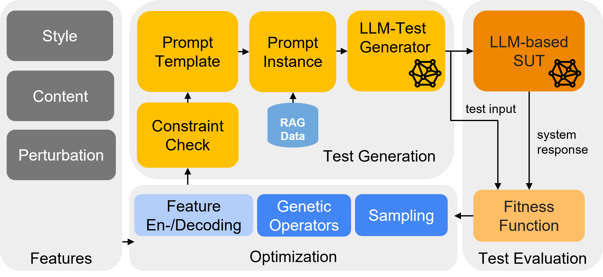

# Replication package for the paper: "STELLAR: A Search-based Testing Framework for Large Language Model Applications"

## Overview

  

STELLAR is a modular search-based testing framework for testing LLM-based Applications. It is built on top of [OpenSBT](www.github.com/opensbt).
Please note, that results are provided partially in the repository as well as in the supplementary pdf in the links below.

## Links

Please click on the corresponding links below to find more information:

[Go to STELLAR Tool / Replication Instructions](./stellar/)

[Go to Conversation Navi Tool](./naviqa/)

[Go to Detailed Results](./results/)

[Go to Supplementary Material](supplementary_material.pdf)
