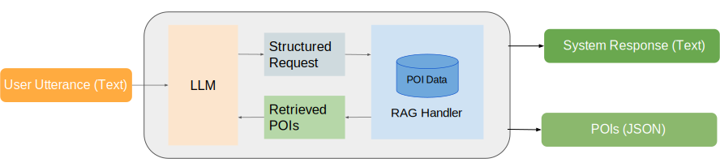

# ConvNavi: POI Recommendation System
## Overview

<p align="center"></p>

Convnavi is a prototypical research implementation of a navigational/Point-of-Interest (POI) recommendation system. It receives as input textual requests regarding POIs and returns POIs from a database that should satisfy POI constraints/attributes provided in the input. The system is using internally an LLM to convert requests into a structured representation to retrieve a set of useful POIs from the database using Retrieval Augmented Generation (RAG). It returns afterwards to the user an LLM-based summerization of the found POIs and the found POIs.

## Setup Instructions

1. **Download the Yelp Dataset**  
   Download and extract the [Yelp academic dataset](https://business.yelp.com/data/resources/open-dataset/) JSON file into the folder:  
   `data/raw/yelp_academic_dataset_business.json`

2. **Install Dependencies**  
   Install the required Python packages listed in `requirements.txt` using:  
   ```bash
   pip install -r requirements.txt
   ```

3. **Configure env variables**

   Select the type of the LLM-model used by setting LLM_MODEL variable in the `.env` file:
   ```
   LLM_MODEL=your_model_used
   ```
   You can also use local, ollama-based models. First you need install [ollama](ollama.com) and then pull the desired model. Currently supported models are listed in the llm_selector file.
   To use azure openai models you have to configure the endpoint and api version in the `.env` file.

## Run the Application

   Start the application from cli:
    ```bash
      python console.py
      ``` 
   Alternatively, you can run the application as a server and send the requests via a client:

   1. Start the FastAPI server by running:  
      ```bash
      python app.py
      ```  
   2. Test the system by executing the client test script:  
      ```bash
      python test/user_test.py
      ```

   Note: in data `data/embeddings.npy`and `filtered_pois.csv` generated embeddings and filtered data are stored
   based on the city selected. If you want to use another city, you need to delete the files to let them be regenerated. They are used for speed-up.

## Example

An example of a request and response with retrieved points of interest (POIs) is given below:

**Request:**  
Hi, direct me to a fine Italian restaurant with more than 4 stars.

**Response:**  
```json
{
  "response": "Ristorante Mezza Luna offers fine Italian dining with a 4.0 rating and upscale ambiance. Shall I navigate you there?",
  "retrieved_pois": [
    {
      "name": "Ristorante Mezza Luna",
      "category": "Restaurants, Italian",
      "rating": 4.0,
      "price_level": "$$$",
      "address": "901 S 8th St",
      "latitude": 39.9383377,
      "longitude": -75.1562457
    },
    {
      "name": "Villa Di Roma",
      "category": "Restaurants, Italian",
      "rating": 4.0,
      "price_level": "$$",
      "address": "936 S 9th St",
      "latitude": 39.9379512,
      "longitude": -75.158238
    },
    {
      "name": "Pat Bombino's",
      "category": "Restaurants, Italian",
      "rating": 4.0,
      "price_level": "$$",
      "address": "767 S 9th St",
      "latitude": 39.9397984,
      "longitude": -75.1575767
    }
  ]
}
```


## API Endpoints

### 1. POST `/query`

**Description:** Executes a RAG navigation query.

**Request Schema (`QueryRequest`):**
- `query` (str, required): Natural language query.
- `user_location` (tuple[float, float], optional): Latitude and longitude; default is Philadelphia, PA.
- `llm_type` (str, optional): Language model for answering.

**Response:** JSON output with POI recommendations and context.

**Error Handling:** Returns HTTP 500 with the exception message if processing fails.

### 2. POST `/poi_exists`

**Description:** Checks for the existence of POIs matching given constraints.

**Request Schema (`POIQueryRequest`):**
- Optional filters: `category`, `cuisine`, `price_level`, `radius_km`, `open_now`, `rating`, `name`, `user_location`, `parking`, `payment`.

**Response Schema (`POIExistsResponse`):**
- `exists` (bool): Indicates if matching POIs exist.
- `matching_pois` (list of dict): POIs matching the constraints.

**Error Handling:** Returns HTTP 500 with the exception message if processing fails.
