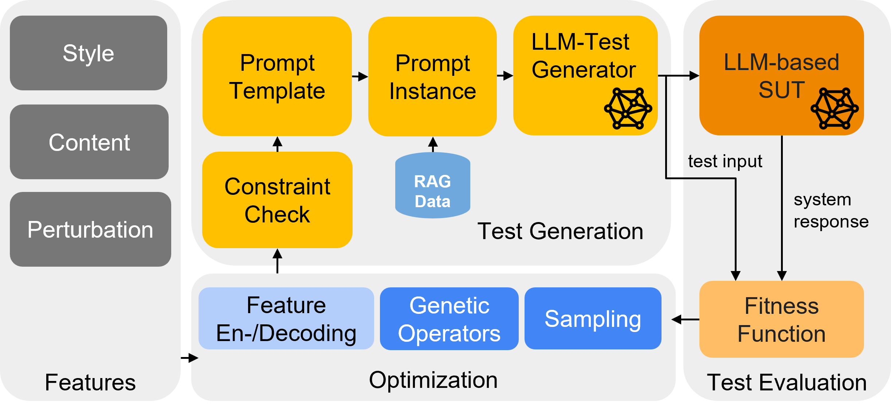

# STELLAR - A Search-based Testing Framework for Large Language Model Applications 


[](LICENSE)
[](https://github.com/opensbt/opensbt-core)

<p align="center">
  
</p>

STELLAR is a modular search-based testing framework for benchmarking LLM-based applications. It builds upon the <a href="https://www.github.com/opensbt">OpenSBT</a> infrastructure and is based on [Pymoo](https://pymoo.org/) 0.6.1.5. STELLAR provides the following core capabilities:

1. Integration of content, stylistic and perturbation features for test generation & feature constraint handling
2. Automated test input generation using prompting and RAG-integration.
3. Fitness evaluation leveraging LLM-based judgments alongside conventional similarity metrics (e.g., cosine similarity).
4. Search-based fitness optimization to support effectiv/efficient failure localization.

## Project Structure 

The project’s structure is outlined below as a high-level overview, omitting detailed files and scripts.

```bash
stellar/
│
├── analysis/            # Paper analysis scripts
├── configs/             # Feature config files
├── examples/            # Implementation of use cases Navi and Safety
├── judge_eval/          # Files for the judge evaluation
├── llm/                 # Main folder extending OpenSBT to support LLM Testing
├── opensbt/             # OpenSBT Base Folder
├── .env-example         # Example .env file to use cloud LLMs
├── README.md            # Project overview
├── requirements.txt     # Dependencies
├── run_tests_navi.py    # Run navi case study
└── run_tests_safety.py  # Run safety case study
```

## Installation

STELLAR requires Python to be installed and its compatibility has been tested with Python 3.11. STELLAR does **not** require GPU resources if cloud LLMs are used.

You can install dependencies via:

```bash
pip install -r requirements.txt
```

STELLAR can be used with local LLMs just as Llama3.2 or Mistral from [Ollama](https://ollama.com), as well as with LLMs deployed in the cloud (OpenAI). Configure the OpenAI endpoint and key via [.env](./.env).  

When using local models, make sure that they have been downloaded via Ollama locally. Make sure hardware requirements are satisfied.

## Getting Started

This framework integrates the following applications for testing:

- Standalone LLMs: Safety, Navigation Question Answering
- [ConvNavi (RAG-based POI recommendations)](https://github.com/Leviathan321/ConvNavi): Navigation Question Answering

The configuration for LLM related experiments is done via the [config.py](./llm/config.py) as well as directly by passing arguments via flags to a corresponding function.


### Navigation

Standalone LLM: To run a simplified example with navigation recommendation based on a pure LLM you can run (here a local LLM is used):

```bash
DEPLOYMENT_NAME="llama3.2" python run_tests_navi.py \
        --sut "IPA_LOS" \
        --judge "llama3.2" \
        --population_size 5 \
        --n_generations 5 \
        --algorithm "nsga2" \
        --max_time "00:10:00" \
        --features_config "configs/navi_features.json"\
        --use_repair \
        --no_wandb \
        --use_rag \
        --seed 1
```

RAG-based SUT: To run a more advanced example where a the RAG-based ConvNavi tool is asked to provide a place recommendation, first setup the ConvNavi tool. After running the tool in server mode, execute the following code for test generation:

```bash
DEPLOYMENT_NAME="llama3.2" python run_tests_navi.py \
        --sut "IPA_YELP" \
        --judge "llama3.2" \
        --population_size 5 \
        --n_generations 5 \
        --algorithm "nsga2" \
        --max_time "00:10:00" \
        --features_config "configs/navi_features.json"\
        --no_wandb \
        --use_rag \
        --seed 1
```

The execution should generate 25 test cases and write down all results in a folder called **results**.

### Safety 

To test standalone LLMs for handling malicious user inputs run:

```bash
python run_tests_safety.py \
        --population_size 5 \
        --sut "llama3.2" \
        --judge "llama3.2" \
        --n_generations 5 \
        --algorithm nsga2 \
        --max_time "00:01:00" \
        --results_folder "/results/" \
        --features_config "configs/safety_features.json"\
        --seed 1
```        
## Search Configuration

STELLAR distinguishes between style, content and perturbation features for test generation. 
The features are defined in the format as shown in the navigational case study in [navi_features.json](configs/navi_features.json).
Modify theses values to see how it affects generated test inputs.

Following algorithms are integrated: 

- **Random Search** (Randomized Testing) - rs
- [**NSGA-II**](`opensbt/algorithm/nsga2_optimizer.py`) (Genetic Algorithm) - nsga2
- [**ASTRAL**](TODO) (Full Coverage Testing Safety) - astral
- [**T-wise**]() (Combinatorial Testing) - gs


Algorithms that exist in pymoo can be also used by implementing interfaces from [OpenSBT](https://opensbt.github.io/opensbt-core/).

## Customization

You can define your own custom problem as done for the Safety or Navigation case study. 
We have provided interfaces and instructions as described in [CUSTOMIZATION](CUSTOMIZATION.md).

## Wandb Integration

STELLAR integrates wandb for experiment progress monitoring and results tracking.
Enable/disable wandb usage by the --wandb flag. Prior logging you need to create a Project at wandb, login via the cli passing the wandb key and update the wandb project name in the main application file. All result artefacts are uploaded to the corresponding run and can be downloaded later for analysis.

```python
weave.init("dev")
wandb.init(
        entity="<your wandb group>",                  # team
        project="<your project name>",                  # the project name
        name=problem_name,                  # run name
        group=datetime.now().strftime("%d-%m-%Y"),  # group by date
        tags=tags,
)
```

## Replication

### RQ0

To replicate the paper results and run the judge evaluation you can use the following script to collect judge results for a given set of question answer pairs. The backend LLM of the LLM-application can be directly set via the __deployment_name__ passed in the commands (here: gpt-4o-mini). 

```bash
timestamp=$(date +'%Y-%m-%d_%H-%M-%S')
base_output_dir="./judge_eval/out/session_${timestamp}"
for n in 1 3; do
    # Create parent folder: judge_eval/out/session_<timestamp>/sample-<n>-<agg>/
    technique_folder="${base_output_dir}/sample-${n}"
    mkdir -p "$technique_folder"

    for i in {1..6}; do
        # Create run subfolder
        run_folder="${technique_folder}/run${i}"
        mkdir -p "$run_folder"

        python -m judge_eval.nuanced_validation_dim \
            --models gpt-35-turbo DeepSeek-V3-0324 gpt-4o-mini gpt-4 gpt-4o gpt-5-chat mistral deepseek-v2 \
            --exp_name "sample-${n}-run${i}" \
            --dataset_path "<path to question answer pairs>" \
            --output_folder "$run_folder" \
            --n_questions 1000 \
            --n_samples $n \
            --aggregator "majority"
    done
done
```

To aggregate judge results evaluate for mulitple runs you can use the following scripts:

```bash

#!/bin/bash
BASE_DIR="<path to the runs>"
GT_CSV="<path to aggregated human annotations>"
SAVE_DIR="./judge-eval/tmp"

mkdir -p "$SAVE_DIR"

# List of sample configurations and runs
SAMPLES=("sample-1-majority" "sample-3-majority")
RUNS=("run1" "run2" "run3" "run4" "run5" "run6")

for SAMPLE in "${SAMPLES[@]}"; do
  for RUN in "${RUNS[@]}"; do
    RUN_DIR="${BASE_DIR}/${SAMPLE}/${RUN}/${SAMPLE}-${RUN}"

    CSV_PATH=$(find "$RUN_DIR" -maxdepth 1 -type f -name "*validation-repeat*.csv" | head -n 1)

    if [[ -f "$CSV_PATH" ]]; then
      OUT_DIR="${SAVE_DIR}/${SAMPLE}/${RUN}"
      mkdir -p "$OUT_DIR"
      echo "Evaluating: ${SAMPLE} - ${RUN}"
      python -m analysis.rq0.evaluate_accuracy_judge_gt \
        --csv_path "$CSV_PATH" \
        --gt_csv_path "$GT_CSV" \
        --json_output_path "${OUT_DIR}/evaluation_results.json" \
        --plot_errors_file "${OUT_DIR}/prediction_errors.png" \
        --plot_efficiency_file "${OUT_DIR}/model_efficiency.png" \
        --plot_f1_file "${OUT_DIR}/model_f1_score.png"

      echo "Done."
    else
      echo "No validation-repeat CSV found in ${RUN_DIR}"
    fi
  done
done
```

You can then run the statistical tests with:

```
bash analysis/rq0/run_statistical_test.sh
```

### RQ1

#### SafeQA

To replicate SafeQA experiments you can run the following command. As seeds, numbers between 1 and 6 have been used in the paper:

```bash
DATE=$(date +%d-%m-%Y)

# RANDOM
python run_tests_safety.py \
                --population_size 2000 \
                --n_generations 1 \
                --algorithm rs \
                --max_time "02:00:00" \
                --results_folder "/results/${DATE}/" \
                --features_config "configs/safety_features.json"\
                --seed 1

# T-wise
python run_tests_safety.py \
        --population_size 2000 \
        --n_generations 1 \
        --algorithm gs \
        --max_time "02:00:00" \
        --results_folder "/results/${DATE}/" \
        --features_config "configs/safety_features.json"\
        --seed 1

# STELLAR
python run_tests_safety.py \
        --population_size 20 \
        --n_generations 100 \
        --algorithm nsga2 \
        --max_time "02:00:00" \
        --results_folder "/results/${DATE}/" \
        --features_config "configs/safety_features.json"\
        --seed 1 \
        --use_repair
```           
#### NaviQA

To replicate NaviQA experiments you need to start for the [NaviQA](/naviqa/) application.
Then you can run the following command. As seeds numbers between 1 and 6 have been used:

```bash
DATE=$(date +%d-%m-%Y)

# RANDOM
N_VALIDATORS=1 DEPLOYMENT_NAME="gpt-4o-mini" python run_tests_navi.py \
        --sut "IPA_YELP" \
        --population_size 10000 \
        --algorithm rs \
        --max_time "03:00:00" \
        --results_folder "/results/${DATE}/" \
        --features_config "configs/navi_features.json"\
        --no_wandb \
        --use_rag \
        --seed 1

# T-wise
N_VALIDATORS=1 DEPLOYMENT_NAME="gpt-4o-mini" python run_tests_navi.py \
        --sut "IPA_YELP" \
        --population_size 10000 \
        --algorithm gs \
        --max_time "00:30:00" \
        --results_folder "/results/${DATE}/" \
        --features_config "configs/navi_features.json"\
        --no_wandb \
        --use_rag \
        --seed 1

# STELLAR
N_VALIDATORS=1 DEPLOYMENT_NAME="gpt-4o-mini" python run_tests_navi.py \
        --sut "IPA_YELP" \
        --population_size 20 \
        --n_generations 30 \
        --algorithm "nsga2" \
        --max_time "03:00:00" \
        --results_folder "/results/${DATE}/" \
        --features_config "configs/navi_features.json"\
        --use_repair \
        --no_wandb \
        --use_rag \
        --seed 1
```

### RQ2

To replicate the metric results including the diversity analysis you can run after all search runs have been completed the following scripts. It is suggested to use wandb storage to store/retrieve the experiment results. The diversity scripts can be also applied to locally stored experiments, after minor modifications in the experiment results retrieval function.

#### SafeQA

```bash
python -m analysis.rq12.get_analysis_safety
```

#### NaviQA

```bash
python -m analysis.rq12.get_analysis_navi
```

You can set the oracle threshold using __th_content=0.75__ and  __th_response=0.75__ to observe how the metrics results vary when the oracle changes.


## Citation

A preprint of the paper can be found on [arXiv](https://arxiv.org/abs/2503.07222).

If you use our work in your research, if you extend it, or if you simply like it, please cite it in your publications. 

Here is an example BibTeX entry:

```
@misc{sorokin2026stellar,
      title={STELLAR: A Search-Based Testing Framework for Large Language Model Applications}, 
      author={Lev Sorokin and Ivan Vasilev and Ken E. Friedl and Andrea Stocco},
      year={2026},
      eprint={2601.00497},
      archivePrefix={arXiv},
      primaryClass={cs.SE},
      url={https://arxiv.org/abs/2601.00497}, 
}
```

## License ##

The software is distributed under MIT license. See the [license](/LICENSE) file.

## Authors

Lev Sorokin (lev.sorokin@tum.de) \
Ivan Vasilev (ivan.vasilev@tum.de)